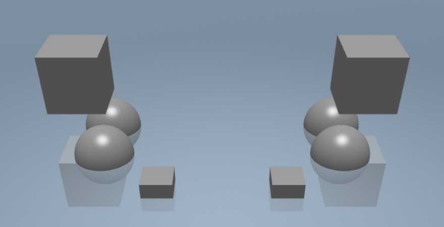
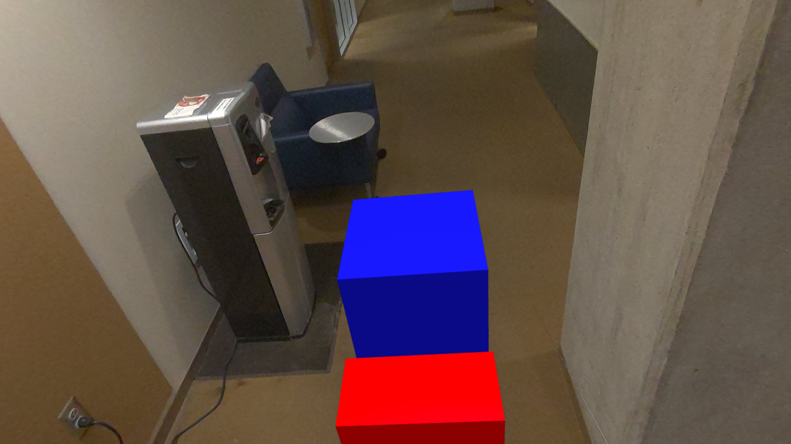

# lecture-7-hands-on
Solutions for the hands on session from lecture 7.

The examples are in two folders. In each folder there is an `index.html` as well as `code.js` file. You can copy the contents of `code.js` directly into the Babylon.js playground.

Additionally the examples have corresponding URLs here:

---

# Example 1: Colors
In this VR example, when you press buttons on the controllers, the object materials will be assigned a random color

---

## Section 2: Boxes
In this AR example, a red box and blue box will be placed on the floor. You can grab and move the boxes with the controller triggers. You can also spawn new boxes at the origin by pressing A or X on the controllers

